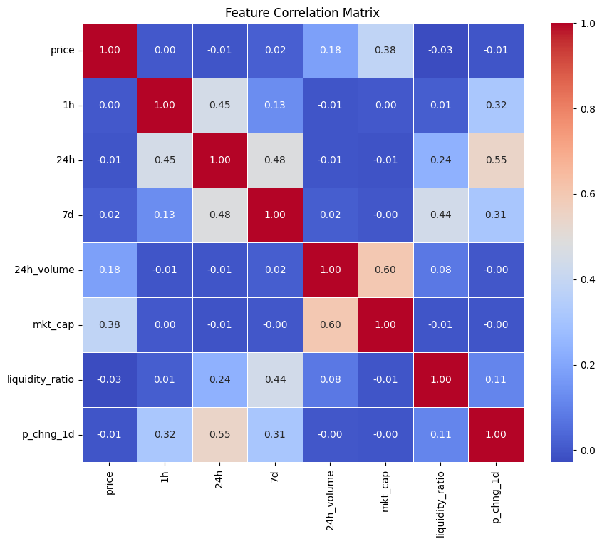
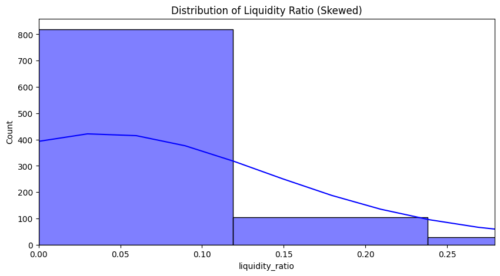
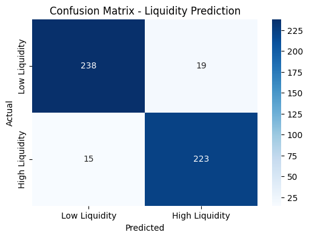
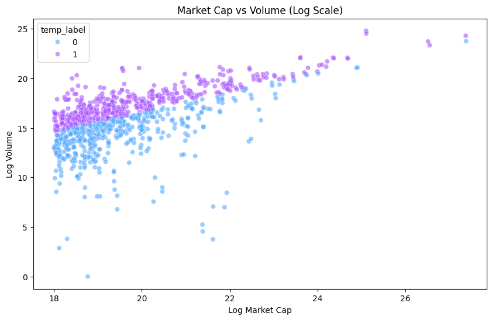

# 🚀 Crypto Liquidity Prediction System

## 📌 Overview
This Machine Learning project predicts whether a Cryptocurrency has **High Liquidity** (Safe to trade) or **Low Liquidity** (Risky) based on market data like Price, Volume, and Market Cap. It uses a **Random Forest Classifier** and serves predictions via a **Flask Web Interface**.

## 🎥 Demo
Here is the Flask Web Interface predicting Liquidity:

here is the Architecture of the project :

## 📊 Key Insights from EDA
During analysis, we found that **Trading Volume** has the highest correlation with Liquidity.

### 1. Correlation Heatmap

### 2. Disrtibution of liquity_ratio

### 3 confusion matrix 

### 4 Market cap VS vol of market

### 5 Distribution of Liquidity_ratio

## 🛠 Tech Stack
- **Frontend:** HTML, CSS (Glassmorphism UI), JavaScript
- **Backend:** Flask (Python)
- **Machine Learning:** Scikit-Learn (Random Forest), Pandas, NumPy
- **Deployment:** Netlify / Gunicorn

## 📂 Project Structure